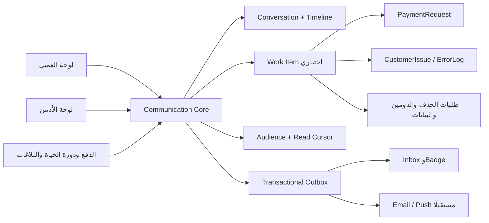
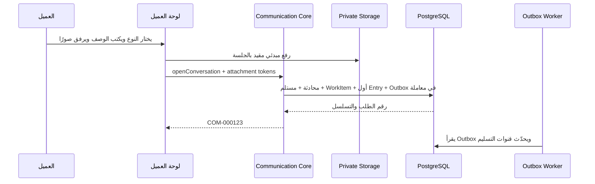
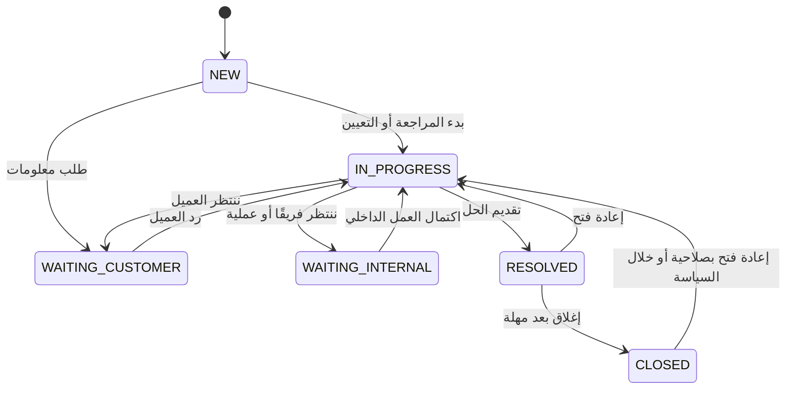

# تقرير تصميم مركز التواصل الموحّد للعملاء

**التاريخ:** 2026-07-18
**الحالة:** مقترح معماري للمراجعة قبل التخطيط أو التنفيذ
**النطاق:** لوحة العميل، لوحة الأدمن، الرسائل، الطلبات، البلاغات، الإعلانات، والإشعارات داخل المنصة

## 1. الملخص التنفيذي

التوصية ليست إنشاء صفحة «طلبات عملاء» جديدة، وليست توسيع جدول `Notification` ليصبح صندوق رسائل. الأفضل هو إنشاء **نواة تواصل موحّدة داخل نفس تطبيق Next.js وقاعدة PostgreSQL الحالية**، تكون المصدر الوحيد لما يلي:

- المحادثات والرسائل المرئية للعميل.
- سجل القراءة والرسائل غير المقروءة.
- الملاحظات الداخلية وتغييرات الحالة داخل Timeline واحد.
- الرسائل المباشرة والإعلانات الجماعية داخل Inbox واحد.
- ربط المحادثة بطلب دعم أو طلب إجراء أو كيان أعمال موجود مثل الدفع أو حذف الحساب.
- توليد التنبيهات وقنوات التسليم من نفس الحدث، من دون نسخ نص الرسالة في أكثر من مصدر.

الاسم المقترح في لوحة العميل هو **«الرسائل والطلبات»**، وعنوان الصفحة **«مركز الرسائل والطلبات»**. هذا أوضح من «مركز التواصل» لأن لوحة العميل الحالية تستخدم «التواصل» بالفعل لبيانات المصور وواتساب وروابط الموقع. في لوحة الأدمن يبقى المركز الأعلى **«مركز التواصل»**، وتصبح وجهة العمل اليومية داخله **«صندوق العملاء»**.

القرار المعماري الأهم هو الفصل بين شيئين:

1. **المحادثة** هي مصدر الحقيقة للنصوص، المرفقات، القراءة، والمشاركين.
2. **طلب العمل** أو كيان المجال هو مصدر الحقيقة للحالة التجارية والإجراء التنفيذي.

بذلك تظل `PaymentRequest` هي حقيقة الدفع، و`CustomerIssue` هو حقيقة التشخيص التقني، بينما تعرض المحادثة تاريخهما الآمن للعميل وتسمح بالنقاش حولهما. لا تتحول المحادثة إلى جدول ضخم يملك منطق الدفع والحذف والدومين والدعم كلها.

## 2. طريقة التحليل وحدوده

تمت مراجعة بنية التطبيق، مخطط Prisma، مسارات لوحة العميل والأدمن، إدارة العملاء، الصلاحيات، أنظمة الرسائل والإشعارات والبلاغات، وخدمات الوسائط. كما تمت مراجعة التصميمات السابقة والتاريخ الحديث للملفات ذات الصلة.

تم تشغيل اختبارات العقود الحالية المرتبطة بالنطاق، وكانت النتيجة **36 اختبارًا ناجحًا من 36** عبر عشرة ملفات تغطي:

- بلاغات العملاء التقنية ودمج التكرارات.
- آلة حالات البلاغات.
- مركز مشاكل العملاء في الأدمن.
- حملات مراسلة العملاء والجمهور.
- ظهور الحملات في لوحة العميل.
- مركز التواصل والتنقل والصلاحيات الحالية.

هذا التقرير قراءة وتصميم فقط. لم يُعدّل أي سلوك ولم تبدأ أي مرحلة تنفيذ.

## 3. خريطة الوضع الحالي

### 3.1 العميل والحساب

- الكيان الذي يمثّل العميل تجاريًا هو `Tenant`.
- مالك العميل هو `User` عبر `ownerUserId`.
- الموقع تابع للـ`Tenant`، وكذلك الاشتراكات والمدفوعات والإشعارات.
- جلسة لوحة العميل الحالية تختار أول `Tenant` غير محذوف وأول موقع له، وأحدث اشتراك.
- مسار ملف العميل في الأدمن `/admin/customers/[id]` يستخدم معرف `Tenant`، وليس معرف `User`.

هذه نقطة مهمة: كل Inbox وطلب ومحادثة يجب أن يُعزل أولًا بالـ`tenantId`، مع حفظ `userId` كهوية الكاتب والقارئ، لا استخدام `userId` بدل هوية العميل التجارية.

### 3.2 لوحة العميل

- لا يوجد حاليًا مسار Inbox أو صفحة سجل طلبات.
- آخر ثلاث حملات نشطة فقط تظهر ككروت أعلى الصفحة الرئيسية.
- لا توجد قراءة لحقل `Notification.readAt` من لوحة العميل، ولا إجراء لتعليم الرسالة كمقروءة.
- زر الدعم الأساسي يفتح واتساب خارجيًا.
- عنصر «التواصل» في التنقل مخصص لبيانات المصور وروابط موقعه، ولذلك لا يصلح اسمه لقسم الرسائل الجديد.
- طلب حذف الحساب يُنشأ من صفحة الإعدادات، لكن العميل لا يحصل على محادثة أو Timeline؛ يرى حالة مختصرة فقط.

### 3.3 لوحة الأدمن

لوحة الأدمن تملك مركزًا أعلى باسم «مركز التواصل»، لكنه حاليًا يجمع روابط وعدادات لأنظمة منفصلة:

- رسائل الاشتراك والتفعيل.
- حملات مراسلة العملاء.
- سجل الإشعارات.
- حالات الدعم.
- البريد.
- مشاكل العملاء التقنية موجودة تحت مركز النظام، لا مركز التواصل.
- طلبات العملاء موجودة تحت مركز العملاء، لا مركز التواصل.

إدارة العملاء نفسها جيدة كأساس: العميل هو `Tenant`، وتوجد فلاتر للحالة والاشتراك والباقة، وملف عميل يحتوي الاشتراك والمدفوعات والوسائط والجلسات والإشعارات والملاحظات. يمكن إعادة استخدام هذه الاستعلامات وعقد الجمهور بدل بناء منطق شرائح جديد.

### 3.4 الأنظمة المتقاربة الموجودة

| النظام الحالي | ما يجيده | ما ينقصه ليكون مركز تواصل |
|---|---|---|
| `CustomerIssue` + `CustomerIssueEvent` | بلاغ تقني، بصمة، دمج تكرار، أولوية، تعيين، Timeline تقني | رسائل متبادلة، مرفقات، قراءة، Inbox للعميل، أنواع طلبات عامة |
| `SupportCase` | موضوع وحالة مرتبطة بعميل | لا رسائل، لا أحداث، لا إنشاء من العميل، لا تعيين أو أولوية أو صفحة تفاصيل |
| `CustomerRequest` | أنواع إجرائية وحالات، ويُستخدم فعليًا لحذف الحساب | لا محادثة، لا مرفقات، لا قراءة، لا سجل أحداث متكامل، والإجراءات متداخلة مباشرة في Server Action |
| `CustomerMessageCampaign` + `Recipient` | جمهور وفلاتر ولقطة مستلمين وإيقاف/تشغيل | لا Inbox كامل، لا قراءة، لا جدولة، لا تصحيح/سحب واضح، والمحتوى يُنسخ إلى جداول أخرى |
| `Notification` | رسالة مرتبطة بـTenant وحقل `readAt` | لا واجهة عميل تقرأها، لا محادثة أو مرفقات أو مرجع مجال موثوق |
| `NotificationLog` | سجل أحداث واجهة/نظام وبحث إداري | ليس Inbox، ولا يملك عقد قراءة مطابقًا لما تعرضه واجهة الأدمن |
| `AdminNote` | ملاحظات داخلية على ملف العميل | ليست مرتبطة بموضوع أو محادثة بعينها |
| رسائل الاشتراك عبر `FeatureFlag`/`NotificationLog` | نصوص حالة دائمة حسب دورة الاشتراك | ليست رسائل زمنية ولا يجب أن تدخل Timeline كمحادثة عادية |

### 3.5 تدفق الحملات الحالي

عند إرسال حملة، تنفذ الخدمة الحالية معاملة واحدة تنشئ:

1. `CustomerMessageCampaign` يحتوي النص.
2. `CustomerMessageRecipient` لكل عميل.
3. `Notification` لكل عميل بالنص نفسه.
4. `NotificationLog` لكل عميل بالنص نفسه.
5. `AuditLog` للعملية.

ثم تقرأ لوحة العميل من `CustomerMessageRecipient -> Campaign` فقط، بينما ملف العميل في الأدمن يقرأ `Notification`. هذه هي أهم نقطة تكرار يجب إزالتها: توجد نسخ متعددة من المحتوى، والواجهة التي يراها العميل لا تعتمد أصلًا على جدول الإشعار ذي `readAt`.

### 3.6 تدفقات أخرى لا تصل إلى Inbox فعلي

- الدفع ودورة حياة الاشتراك ينشئان `Notification` و`NotificationLog`، لكن لوحة العميل الرئيسية لا تقرأ `Notification`.
- حل البلاغ التقني يستطيع إنشاء `Notification`، لكن العميل لا يملك صفحة تعرض تاريخ البلاغ.
- رفض طلب حذف الحساب ينشئ `Notification`، بينما الموافقة قد تحذف/تعطّل الحساب قبل أن يستطيع العميل قراءة الإشعار.
- `SupportCase` يُعرض في الأدمن فقط ولا يوجد مسار إنشاء أو رد عليه.

## 4. فرص إعادة الاستخدام وما لا يجب إعادة بنائه

يجب إعادة استخدام الآتي:

- `Tenant` كحد العزل الأساسي للعميل.
- `User` لهوية العميل الكاتب والقارئ.
- `AdminUser` لهوية المشرف، بعد توحيد مسار استرجاع هوية الأدمن.
- منطق جمهور الحملات الحالي وفلاتر حالة العميل والاشتراك والباقة.
- `CustomerIssue` و`ErrorLog` للتشخيص التقني، لا نسخ بياناتهما إلى محادثة عامة.
- `PaymentRequest` وسجل الدفع للحقيقة المالية.
- `AuditLog` للأفعال الحساسة، من دون نسخ نصوص الرسائل كاملة داخله.
- نمط الخدمات والمستودعات الحالي في `src/modules`، ومعاملات Prisma.
- معالجة الصور الحالية من حيث فحص التوقيع، التحجيم، والتحويل، بعد وضع Adapter تخزين خاص بالمرفقات.
- سجل المسارات المركزي للأدمن، وأنماط `AdminPageShell` والجداول/البطاقات المتجاوبة.

لا يجب إعادة استخدام `MediaAsset.url` العامة لمرفقات الدعم الحساسة؛ صور الأخطاء وإثباتات المشكلات قد تحتوي بيانات شخصية. التخزين الحالي مصمم لوسائط الموقع العامة ويمكن أن يكتب إلى `public/uploads` أو GitHub Raw. مرفقات المحادثات تحتاج تخزينًا خاصًا وروابط موقعة قصيرة العمر.

## 5. ملاحظات معمارية تحتاج معالجة أثناء المشروع

هذه ليست كلها أخطاء مؤكدة، لكنها نقاط خطر مثبتة من تركيب الكود الحالي:

1. روابط العميل داخل مركز `CustomerIssue` تُبنى أحيانًا من `reporter.id` وهو `User.id`، بينما صفحة العميل تتوقع `Tenant.id`.
2. هوية الأدمن موزعة بين `User` و`AdminUser` و`Session` و`AdminSession` ومسار جلسة موقعة؛ أي Timeline جديد يجب ألا يكرر هذا الالتباس.
3. `AdminNote.authorId` مرتبط بجدول `User`، بينما تسجيل دخول الأدمن الحديث يستخدم `AdminUser`. هذا يجعل نقل الملاحظات الداخلية إلى نموذج Actor واضح أمرًا مهمًا.
4. واجهة سجل الإشعارات تفترض حقولًا مثل `readAt` و`userId` على عناصر `NotificationLog` بينما مخطط الجدول لا يحتويها.
5. إيقاف حملة منشورة يخفيها من لوحة العميل. هذا سلوك مناسب لمسودة أو جدولة، لكنه يغير التاريخ بعد التسليم؛ الأفضل التفريق بين الإيقاف قبل النشر، والأرشفة، والسحب الصريح بعد النشر.
6. موافقة طلب حذف الحساب مرتبطة مباشرة بإجراء حذف واسع. هذا النوع يحتاج Workflow متخصصًا، إعادة تحقق، فترة سماح، وتدقيقًا أقوى من تغيير حالة طلب عام.

## 6. البدائل المعمارية

### البديل الأول: توسيع `CustomerRequest`

نضيف رسائل ومرفقات وقراءة إلى `CustomerRequest`، ونستخدمه لكل شيء.

**الميزة:** أسرع بداية وأقل جداول جديدة.
**العيوب:** الإعلانات ليست طلبات، والرسائل المباشرة ليست طلبات، والبلاغ التقني له نموذج مختلف، وسيصبح الجدول محملًا بحقول اختيارية ومنطق حالات متعارض. هذا حل قصير العمر وغير موصى به.

### البديل الثاني: جعل `Notification` هو المصدر الموحد

نحوّل كل رسالة ورد وطلب إلى Notification مترابط.

**الميزة:** Badge والقراءة يبدوان بسيطين.
**العيوب:** الإشعار أثر توصيل، وليس محادثة أو Workflow. سيصعب تمثيل الردود والملاحظات الداخلية والحالة والتعيين والمرفقات والجمهور من دون تحويله إلى جدول عملاق. غير موصى به.

### البديل الثالث: نواة محادثة + طلب عمل اختياري + توزيع موحّد

كل موضوع يملك `CommunicationConversation`، وكل شيء يظهر في Timeline هو `CommunicationEntry`. إذا كان الموضوع يحتاج متابعة وحالة، يرتبط بـ`CommunicationWorkItem`. وإذا كان إعلانًا جماعيًا، ترتبط المحادثة بـ`CommunicationCampaign` وجمهورها، مع حفظ المحتوى مرة واحدة.

**المزايا:** مصدر محتوى واحد، Inbox واحد، قابلية توسع، فصل جيد بين التواصل ومنطق الأعمال، ودعم مباشر للحملات والقراءة والمرفقات.
**التكلفة:** يحتاج ترحيلًا منظمًا وتعريفًا دقيقًا للهويات والقراءة.
**التوصية:** هذا هو التصميم المعتمد في بقية التقرير.

لا أوصي بـMicroservices أو Kafka أو Redis في هذه المرحلة. التطبيق الحالي Modular Monolith، وPostgreSQL مع Transactional Outbox وWorker عبر Cron يكفيان. يمكن استبدال Adapter التسليم لاحقًا دون تغيير واجهة نواة التواصل.

## 7. اللغة الموحدة للنطاق

- **المحادثة:** حاوية موضوع واحد وتاريخه الكامل، سواء بدأها العميل أو الأدمن أو النظام.
- **مدخل المحادثة:** عنصر مرتب في Timeline؛ رسالة، ملاحظة داخلية، تغيير حالة، تعيين، أو حدث نظام.
- **طلب العمل:** متابعة تشغيلية مرتبطة بمحادثة وتملك الحالة والأولوية والمسؤول وSLA.
- **المستلم:** Tenant يحق له رؤية محادثة مباشرة أو إعلان جماعي.
- **مؤشر القراءة:** آخر رقم تسلسلي قرأه مستخدم أو أدمن داخل المحادثة.
- **الحملة:** سياسة نشر وجدولة وجمهور لمحادثة جماعية؛ لا تملك نسخة أخرى من نص الرسالة.
- **التسليم:** محاولة إرسال مدخل موجود إلى قناة خارجية مثل البريد أو Push؛ ليس نسخة محتوى مستقلة.
- **سجل التدقيق:** سجل الأفعال الحساسة ومن نفذها؛ لا يُستخدم كصندوق رسائل.
- **البلاغ التقني:** `CustomerIssue` المرتبط بأخطاء فعلية؛ قد يرتبط بمحادثة، لكنه لا يتحول إلى رسالة عامة.

## 8. المعمارية المقترحة

### 8.1 الوحدات العميقة

#### `communication-core`

واجهته الخارجية صغيرة وتخفي المعاملات والقواعد:

- `openConversation(input)`
- `appendEntry(input)`
- `markRead(input)`
- `transitionWorkItem(input)`
- `publishCampaign(input)`

لا تستدعي الصفحات Prisma مباشرة لكتابة التواصل. كل الكتابة تمر بهذه الوحدة حتى تضمن العزل، التسلسل، القراءة، التدقيق، وOutbox مرة واحدة.

#### `communication-audience`

تحل الجمهور من فلاتر `Tenant` والاشتراك والباقة والاختيار الصريح. منطق `buildCustomerOutreachAudienceWhere` الحالي هو بداية جيدة ويُنقل خلف هذه الواجهة بدل نسخه في الصفحات.

#### `communication-delivery`

تقرأ Outbox وتنفذ قنوات التسليم. Adapter داخل المنصة يحدّث المستلمين فقط، وAdapters البريد وPush تضاف لاحقًا. فشل البريد لا يلغي الرسالة الأصلية.

#### `communication-attachments`

يرفع إلى تخزين خاص، يفحص النوع والحجم والتوقيع، يزيل EXIF، ويصدر رابطًا موقعًا بعد فحص الصلاحية. معالجة الصور الحالية يمكن أن تكون Adapter للصور، لا التخزين العام الحالي.

#### `communication-workflows`

يحتوي سياسات الحالة حسب النوع. النواة تعرف حالات مشتركة، بينما حذف الحساب والدفع والدومين يملكون منطق مجال خاصًا مرتبطًا بالمحادثة.

## 9. تصميم قاعدة البيانات

الأسماء التالية مقترحة لتوضيح الملكية ويمكن ضبطها قبل التنفيذ.

### 9.1 `CommunicationConversation`

| الحقل | الغرض |
|---|---|
| `id`, `number` | معرف داخلي ورقم عرض مثل `COM-000123` |
| `mode` | `DIRECT` أو `BROADCAST` |
| `tenantId` | مطلوب للمحادثة الخاصة، وفارغ للبث العام |
| `parentConversationId` | ربط سؤال خاص بإعلان عام أو متابعة بموضوع سابق |
| `typeKey` | نوع قابل للتوسع دون تعديل مخطط الحالات كل مرة |
| `subject` | عنوان الموضوع |
| `lifecycleState` | `ACTIVE`, `ARCHIVED`, `WITHDRAWN`؛ ليست حالة طلب العمل |
| `replyMode` | `ENABLED`, `DISABLED`, `PRIVATE_BRANCH` |
| `lastActivityAt` | ترتيب Inbox |
| `lastSequence` | آخر رقم Timeline |
| `lastCustomerVisibleSequence` | حساب القراءة دون الملاحظات الداخلية |
| `version` | تحكم تفاؤلي في التعارض |
| التواريخ وهوية الإنشاء | تدقيق وإنشاء |

قيد قاعدة بيانات يضمن أن `DIRECT` يملك `tenantId` وأن `BROADCAST` لا يخلط عدة عملاء داخل محادثة قابلة للرد.

### 9.2 `CommunicationEntry`

| الحقل | الغرض |
|---|---|
| `conversationId`, `sequence` | ترتيب ثابت وفريد داخل المحادثة |
| `kind` | `MESSAGE`, `INTERNAL_NOTE`, `STATE_CHANGE`, `ASSIGNMENT`, `SYSTEM_EVENT`, `CORRECTION` |
| `visibility` | `CUSTOMER_AND_ADMIN` أو `ADMIN_ONLY` |
| `authorType` | `CUSTOMER`, `ADMIN`, `SYSTEM` |
| `authorUserId` / `authorAdminUserId` | FK صريح بدل Actor متعدد غامض |
| `body` | النص المنقّى؛ فارغ فقط للأحداث التي لا تحتاج نصًا |
| `idempotencyKey` | منع تكرار الرسالة عند إعادة الطلب |
| `createdAt`, `editedAt`, `redactedAt` | التاريخ وسياسة التعديل/الإخفاء |

القيد الفريد `(conversationId, sequence)` يحفظ الترتيب. الرسائل المنشورة لا تُحذف بصمت؛ التصحيح يُسجل كمدخل جديد أو Redaction مدقق.

### 9.3 `CommunicationAudience`

صف واحد لكل `Tenant` يستلم المحادثة، سواء كانت خاصة أو جماعية:

- `conversationId`, `tenantId` بقيد فريد.
- `deliveredAt` و`archivedAt` و`withdrawnAt`.
- لقطة اختيارية لسبب دخول العميل في الجمهور.
- فهارس على `(tenantId, archivedAt, deliveredAt)`.

النص لا يُنسخ هنا؛ إعلان واحد يملك مدخلًا واحدًا وN صفوف جمهور خفيفة.

### 9.4 `CommunicationReadCursor`

- `conversationId`.
- `userId` أو `adminUserId`، مع قيد يفرض وجود واحد فقط.
- `lastReadSequence` و`readAt`.
- تحديث Monotonic باستخدام القيمة الأكبر فقط.

مصدر الحقيقة لغير المقروء هو الفرق بين المدخلات المرئية ومؤشر القراءة. يمكن حفظ عداد مشتق لتحسين الأداء، لكن يجب أن يكون قابلًا لإعادة البناء ولا يصبح مصدرًا ثانيًا.

### 9.5 `CommunicationWorkItem`

علاقة اختيارية واحد لواحد مع المحادثة:

- `status`: `NEW`, `IN_PROGRESS`, `WAITING_CUSTOMER`, `WAITING_INTERNAL`, `RESOLVED`, `CLOSED`.
- `priority`: `LOW`, `NORMAL`, `HIGH`, `URGENT`.
- `queueKey`: `SUPPORT`, `BILLING`, `ACCOUNT_PRIVACY`, `DOMAINS`, `PRODUCT`.
- `assigneeAdminUserId`.
- `slaPolicyKey`, `firstResponseDueAt`, `resolutionDueAt`.
- `firstResponseAt`, `resolvedAt`, `closedAt`.
- `contextType` للعرض فقط، بينما الربط القوي يكون من كيان المجال إلى `conversationId` أو `workItemId`.

لا يُخزن «تم الرد» كحالة؛ الرد نشاط، أما الحالة فتجيب: من ينتظر من؟ وهل الموضوع ما زال يحتاج عملًا؟

### 9.6 `CommunicationAttachment`

- `entryId` و`storageKey` خاص.
- الاسم الأصلي، MIME، الحجم، checksum، العرض والارتفاع.
- `scanStatus`: `PENDING`, `CLEAN`, `REJECTED`.
- هوية الرافع وتاريخ الحذف/الحجب.

لا يُخزن رابط عام دائم. الوصول يتم عبر Route يتحقق من جلسة العميل/الأدمن ثم يصدر Signed URL قصير العمر.

### 9.7 `CommunicationCampaign`

- `conversationId` فريد؛ المحتوى موجود في `CommunicationEntry` فقط.
- `status`: `DRAFT`, `SCHEDULED`, `PUBLISHING`, `PUBLISHED`, `WITHDRAWN`, `CANCELLED`.
- `audienceDefinition` و`audienceVersion`.
- `recipientCount`, `scheduledAt`, `publishedAt`, `withdrawnAt`.
- منشئ الحملة وسبب السحب إن وجد.

### 9.8 `CommunicationOutboxEvent` و`CommunicationDeliveryAttempt`

Outbox يُكتب في نفس معاملة الرسالة ويحتوي معرفات الحدث فقط، لا نسخة جديدة من النص. Worker ينشئ محاولة تسليم لكل قناة خارجية مع الحالة، عدد المحاولات، Provider ID، والخطأ المنقّى.

### 9.9 تعريف أنواع التواصل

يُستخدم `typeKey` نصي ثابت مع Registry موثوق، ويمكن دعمه بجدول Seeded باسم `CommunicationTypeDefinition` يحتوي الاسم الظاهر، المجموعة، الطابور، سياسة Workflow، الترتيب، والحالة. لا أوصي بمحرر Form Schema ديناميكي كامل في المرحلة الأولى؛ هذا تعقيد غير مطلوب.

## 10. تدفق البيانات

### 10.1 إنشاء طلب من العميل

كل `tenantId`, `userId`, و`siteId` الموثوقة تُشتق من الجلسة على السيرفر. لا يقبل الأمر هذه القيم من نموذج العميل كسلطة.

### 10.2 رد الأدمن

1. يتحقق `communications:reply` ونطاق الصف الإداري.
2. يقرأ `version` أو آخر Sequence لمنع تضارب الردود.
3. يضيف `MESSAGE` مرئيًا للعميل.
4. يغيّر الحالة تلقائيًا من `WAITING_INTERNAL` إلى `IN_PROGRESS` عند الحاجة، أو يترك الأدمن يختار «بانتظار العميل» بوضوح.
5. يكتب Outbox ويحدث `lastActivityAt` داخل المعاملة نفسها.
6. يظهر Badge للعميل من مؤشر القراءة، لا من عداد محلي في React.

### 10.3 قراءة المحادثة

بعد نجاح عرض أحدث Timeline، ترسل الواجهة `markRead(upToSequence)`. ينفذ السيرفر تحديثًا بالقيمة الأكبر فقط. إذا وصلت رسالة بين التحميل وتعليم القراءة فلن تختفي علامتها، لأن Sequence الجديدة أعلى من `upToSequence`.

### 10.4 الإعلان الجماعي

1. الأدمن ينشئ مسودة ومحتوى واحدًا.
2. الخادم يعرض Preview لعدد الجمهور من نفس Audience Resolver المستخدم عند النشر.
3. عند النشر، تُثبت لقطة الجمهور وتُنشأ `CommunicationAudience` على دفعات.
4. يظهر الإعلان في Inbox كل مستلم، والمحتوى مخزن مرة واحدة.
5. الإعلان الافتراضي للقراءة فقط. إجراء «اسأل عن هذا الإعلان» ينشئ محادثة خاصة مرتبطة بالأصل؛ لا يمكن أن يرى عميل رد عميل آخر.
6. بعد النشر لا يستخدم «إيقاف» لمحو التاريخ. الخيارات هي الأرشفة المحلية أو السحب الصريح مع سبب ظاهر.

## 11. تصنيف الطلبات

عرض سبعة أنواع متساوية للعميل يزيد التردد. الأفضل واجهة من ثلاث نوايا، ثم اختيار فرعي بسيط:

### أ. أحتاج مساعدة

- سؤال عن الاستخدام.
- مشكلة تقنية.
- مشكلة دخول أو حساب.

### ب. أريد تنفيذ طلب

- تعديل على الموقع أو الحساب.
- تفعيل ميزة.
- دومين.
- دفع أو اشتراك.
- نقل/تصدير بيانات.
- حذف حساب.

### ج. لدي ملاحظة

- اقتراح.
- فكرة ميزة.
- بلاغ عن محتوى أو إساءة.
- أخرى.

الواجهة تعرض النية أولًا، ثم الأنواع المتاحة. خلفيًا يحتفظ النظام بـ`typeKey` دقيق للتوجيه والسياسة. طلب حذف الحساب لا يُعامل كنص حر؛ يفتح Workflow متخصصًا مع إعادة تحقق وخطوات آمنة.

## 12. دورة حياة الطلب

الدورة المقترحة:

قواعد مهمة:

- `NEW` تعني لم يبدأ العمل بعد.
- `IN_PROGRESS` تعني أن المسؤول يعمل عليه.
- `WAITING_CUSTOMER` تحمي SLA الفريق من الوقت الذي ينتظر فيه معلومات العميل.
- `WAITING_INTERNAL` أفضل من إبقاء الطلب «قيد المراجعة» بلا تفسير.
- `RESOLVED` تعني أن حلًا أُرسل ويمكن للعميل إعادة الفتح.
- `CLOSED` نهاية إدارية بعد مهلة، لا مجرد إرسال رد.
- رد العميل على `WAITING_CUSTOMER` يعيد الطلب تلقائيًا إلى `IN_PROGRESS` ويضعه أعلى صندوق الأدمن.
- الرد على طلب محلول خلال مهلة، مثل 14 يومًا، يعيد فتح نفس الموضوع. بعد المهلة ينشئ متابعة مرتبطة إذا كان السياق مختلفًا.
- «الأولوية» يملكها النظام/الأدمن. العميل يختار الأثر أو يصف المشكلة، ولا يعيّن طلبه «حرجًا» مباشرة.

## 13. تجربة العميل

### 13.1 التنقل وBadge

- عنصر باسم **«الرسائل والطلبات»** في أدوات لوحة العميل.
- على سطح المكتب يظهر في الشريط الجانبي مع Badge رقمي محدود بصريًا إلى `99+`.
- على الهاتف يظهر رمز Inbox في الشريط العلوي مع Badge، ويظل العنصر موجودًا داخل «المزيد».
- لأن الهدف أن يكون المركز مرجع التواصل الوحيد، ينتقل دعم واتساب من إجراء أساسي دائم إلى خيار احتياطي داخل المركز: «تحتاج مساعدة عاجلة خارج المنصة؟».
- Badge يحسب المحادثات ذات مدخلات عميل مرئية بعد مؤشر القراءة. فتح الصفحة وحده لا يمسح كل شيء؛ تعليم القراءة يتم حتى آخر Sequence عُرض بنجاح.

### 13.2 الصفحة الرئيسية للمركز

على الهاتف:

- رأس مختصر: «كل رسائلك وطلباتك في مكان واحد» وزر «طلب جديد».
- Chips: الكل، يحتاج ردك، الطلبات، الإعلانات، المغلق.
- كل عنصر بطاقة تعرض الرقم، العنوان، النوع، الحالة، آخر نشاط، مقتطف آخر رسالة، وعدد غير المقروء.
- لا يُستخدم جدول أفقي.

على سطح المكتب:

- Split View: قائمة قابلة للبحث والفلترة في جانب، والمحادثة المختارة في الجانب الآخر.
- الروابط تبقى Routes حقيقية قابلة لإعادة التحميل والمشاركة، لا حالة Client-only.

### 13.3 إنشاء طلب

نموذج واحد خفيف:

1. «ماذا تريد أن تفعل؟» بثلاث نوايا واضحة.
2. نوع فرعي مناسب.
3. عنوان مقترح قابل للتعديل.
4. وصف مع أمثلة قصيرة لما يساعد الفريق.
5. حتى خمس صور Screenshot في المرحلة الأولى، مع معاينة وحذف قبل الإرسال.
6. زر واحد «إرسال الطلب» وحالة رفع واضحة.

لا يُطلب من العميل اختيار أولوية أو فريق أو حالة. البيانات التقنية الآمنة مثل Route والمتصفح وSite ID يمكن إرفاقها تلقائيًا عند الإبلاغ عن مشكلة تقنية.

### 13.4 داخل المحادثة

- شريط علوي ثابت نسبيًا: الرقم، العنوان، النوع، الحالة، وآخر تحديث.
- Timeline واحد مرتب تصاعديًا مع فصل الأيام.
- رسائل العميل والأدمن بأسلوبين واضحين، من دون تحويل الواجهة إلى تقليد دردشة اجتماعية.
- أحداث الحالة والتعيين تظهر كسطور Timeline خفيفة.
- الصور تظهر Grid قابلة للفتح، والملفات مستقبلًا تعرض الاسم والنوع والحجم.
- حالة رسالة العميل: «أُرسلت»، ثم «قرأها الفريق» عند وجود قراءة فعلية.
- Composer مثبت أسفل الشاشة على الهاتف، مع حفظ المسودة محليًا واستعادة آمنة.
- إذا كانت الحالة `RESOLVED` يظهر سؤال واضح: «هل تم حل المشكلة؟» مع «نعم، أغلق الطلب» و«لا، أعد فتحه».
- المحادثة المغلقة تبقى قابلة للقراءة بالكامل.

### 13.5 الإعلانات

- تظهر في Inbox نفسه بعلامة «إعلان» أو «تنبيه».
- الإعلان لا يتظاهر بأنه طلب دعم ولا يأخذ حالة طلب.
- يمكن تثبيت إعلان مهم لمدة محددة من دون إبقاء كل الإعلانات أعلى الصفحة.
- «اسأل عن هذا الإعلان» يفتح فرعًا خاصًا مرتبطًا به.

## 14. تجربة الأدمن

### 14.1 موضع النظام

- يبقى `/admin/communications` مركز الملخص.
- تُضاف وجهة تشغيل رئيسية `/admin/communications/inbox` باسم «صندوق العملاء».
- تتحول `/admin/customer-requests` و`/admin/support` تدريجيًا إلى Views محفوظة أو Redirects متوافقة إلى الصندوق.
- يبقى `/admin/errors` مركزًا تقنيًا متخصصًا، مع رابط للمحادثة المرتبطة عندما يوجد تواصل مع العميل.
- تبقى رسائل الاشتراك الدائمة في إعداداتها لأنها State-based copy وليست رسائل زمنية.

### 14.2 قائمة العمل

Views افتراضية:

- جديد وغير مسند.
- طلباتي.
- بانتظار العميل.
- بانتظار داخلي.
- عاجل.
- تم الحل حديثًا.
- الإعلانات والحملات.

الفلاتر:

- بحث بالرقم والعنوان والعميل والبريد.
- الحالة، النوع، الطابور، الأولوية، المسؤول، الباقة، وحالة الاشتراك.
- آخر نشاط، الأقدم بلا رد، موعد SLA، والأولوية.

على سطح المكتب يفضل تخطيط قائمتين: قائمة العمل + التفاصيل. لا حاجة لثلاثة أعمدة دائمة لأن لوحة الأدمن الحالية كثيفة أصلًا. الفلاتر المتقدمة Drawer. على الهاتف تظهر القائمة ثم صفحة التفاصيل كاملة.

### 14.3 داخل الطلب

- ملخص العميل والموقع والاشتراك في شريط جانبي/Drawer قابل للفتح، لا فوق Timeline بالكامل.
- رد عام، ملاحظة داخلية، وتغيير الحالة أفعال منفصلة بوضوح.
- الملاحظة الداخلية تحمل لونًا وأيقونة ونصًا ثابتًا «لا يراها العميل».
- التعيين والطابور والأولوية وSLA في Header تشغيل صغير.
- الرد وتغيير الحالة يمكن تنفيذهما معًا في فعل واحد مقصود، مثل «إرسال واعتبار الطلب بانتظار العميل».
- تفاصيل الخطأ التقنية تبقى في `CustomerIssue` ولا تُعرض افتراضيًا في المحادثة.
- يظهر سجل القراءة والتسليم للأدمن، مع تجنب ادعاء «مقروء» إذا لم يصل حدث قراءة فعلي.

### 14.4 ملف العميل

قسم «الدعم والحماية» في ملف العميل لا ينشئ رسائل في نظام موازٍ. يعرض آخر المحادثات ويفتح نفس صندوق العملاء، وزر الإرسال ينشئ `DIRECT Conversation` عبر النواة نفسها.

الملاحظات العامة على العميل يمكن أن تبقى في `AdminNote`، أما الملاحظات الخاصة بموضوع فتكون `INTERNAL_NOTE` داخل المحادثة. يجب ألا تختلط الاثنتان.

## 15. الرسائل العامة والجمهور

يُعاد استخدام منطق الجمهور الحالي ويوسع تدريجيًا:

- جميع العملاء غير المحذوفين.
- التجريبيون.
- المشتركون النشطون.
- المنتهية تجاربهم أو اشتراكاتهم.
- المتأخرون في الدفع أو حالات اشتراك محددة.
- باقة أو مجموعة باقات.
- عملاء محددون.
- Segment محفوظ أو Tag مستقبلي.

قواعد النشر:

- Preview بعدد الجمهور وعينة أسماء.
- إعادة حل الجمهور على الخادم وقت النشر.
- حفظ Definition وSnapshot ونسخة سياسة الجمهور.
- منع المستلمين المكررين بقيد فريد.
- النشر على دفعات، لا معاملة مفتوحة ضخمة لآلاف العملاء.
- الحملة تنتقل `PUBLISHING -> PUBLISHED`، ويستطيع Worker استكمال الدفعات بأمان عبر idempotency.
- المحتوى المنشور يصبح Immutable؛ التصحيح أو السحب حدث ظاهر ومدقق.
- الإحصاءات: وصل داخل المنصة، قُرئ، أُرشف، وفشل قناة خارجية. لا تخلط «الظهور في Inbox» مع «قراءة النص».

## 16. نظام الإشعارات الموحّد

### 16.1 القاعدة

**المحادثة ومدخلاتها هي المحتوى. الإشعار مجرد قرار توصيل.**

عند إضافة رد أو إعلان:

1. يُحفظ المدخل مرة واحدة.
2. تُحدّث حالة المستلم والقراءة.
3. يُكتب Outbox Event بالمعرفات.
4. تطبق `NotificationPolicy` القنوات المسموحة حسب نوع الحدث وتفضيلات العميل.
5. تسجل `DeliveryAttempt` نتيجة البريد/Push مستقبلًا.

لا ينشأ جدول `Notification` جديد يحمل نسخة النص. يمكن إبقاء الجدول الحالي كطبقة توافق أثناء الترحيل ثم إيقاف الكتابة إليه.

### 16.2 ما يدخل Inbox وما لا يدخل

يدخل Inbox:

- رد جديد.
- رسالة مباشرة.
- إعلان أو تنبيه عام.
- تحديث مهم على طلب دفع/حذف/دومين عندما توجد قيمة للعميل.

لا يدخل تلقائيًا:

- كل Toast نجاح أو خطأ محلي.
- `NotificationLog` التشغيلي.
- كل `AuditLog`.
- كل تغير داخلي لا يحتاج العميل معرفته.
- رسائل الاشتراك الدائمة التي تصف الحالة الحالية؛ تظل Card حالة، ويمكن توليد مدخل زمني فقط عند تغير فعلي مهم.

### 16.3 Badge

- Badge لوحة العميل = عدد المحادثات التي تحتوي مدخلات مرئية بعد Cursor المستخدم.
- Badge الأدمن التشغيلي = عدد Work Items التي تحتاج تدخلًا وفق View، وليس مجموع `Notification.readAt` لكل العملاء.
- Topbar الأدمن يمكن أن يعرض «جديد/غير مسند» بدل رقم إشعارات العملاء غير المقروءة، لأن قراءة العميل ليست مهمة أدمن عاجلة.

## 17. الصلاحيات

الصلاحيات المقترحة أدق من `messages:view/edit` و`support:view/edit` الحالية:

| الصلاحية | الاستخدام |
|---|---|
| `communications:view` | عرض Inbox وفق الطوابير المسموحة |
| `communications:reply` | إرسال رد مرئي للعميل |
| `communications:note` | إضافة ملاحظة داخلية |
| `communications:assign` | تغيير المسؤول أو الطابور |
| `communications:transition` | تغيير حالة طلب العمل |
| `communications:priority` | تغيير الأولوية/SLA |
| `broadcasts:create` | إنشاء مسودة |
| `broadcasts:publish` | نشر لجمهور |
| `broadcasts:withdraw` | سحب رسالة منشورة |
| `communication-sensitive:view` | رؤية مرفقات/سياق حساس |

يُبنى Adapter توافق يترجم الأدوار الحالية إلى هذه القدرات في البداية. مثلًا `SUPPORT_AGENT` يرد ويكتب ملاحظات ويغيّر الحالة، لكنه لا ينشر حملة لكل العملاء. `BILLING_MANAGER` يرى طابور الدفع فقط. `SUPER_ADMIN` يملك النشر والسحب.

## 18. الأمان والخصوصية

- اشتقاق Tenant/User/Site من الجلسة، وعدم الثقة في IDs من المتصفح.
- كل استعلام عميل يفرض `tenantId` قبل `conversationId` لمنع IDOR.
- روابط مرفقات موقعة قصيرة العمر وتخزين خاص.
- JPEG/PNG/WebP فقط أولًا، حتى خمس صور، وحد مناسب مثل 10MB قبل المعالجة.
- فحص Magic Bytes، إزالة EXIF، checksum، حد أبعاد، وVirus Scan قبل فتح أنواع الملفات العامة مستقبلًا.
- Sanitization للنص وURLs، وحدود أطوال، وRate Limit لإنشاء الطلبات والرسائل والرفع.
- CSRF/Origin validation لأوامر الكتابة المناسبة.
- Idempotency Key لكل إرسال من العميل ولكل دفعة حملة.
- عدم نسخ كلمات المرور أو Tokens أو Stack Trace إلى المحادثة.
- Redaction مدقق للبيانات الحساسة بدل الحذف الصامت.
- سياسة Retention واضحة: عند حذف حساب، تزال/تُخفى PII والمرفقات وفق السياسة، مع الاحتفاظ بالحد الأدنى القانوني/التدقيقي اللازم.
- طلب حذف الحساب يحتاج إعادة تحقق من العميل، فترة سماح قابلة للإلغاء، وفصل «الموافقة» عن «تنفيذ الحذف».

## 19. الأداء والاعتمادية

- Cursor Pagination على `(tenantId, lastActivityAt, id)` للعميل، وعلى `(queueKey, status, lastActivityAt, id)` للأدمن.
- عدم تحميل المرفقات أو Body كاملًا في قائمة Inbox؛ تُقرأ مقتطفات خفيفة.
- فهارس مركبة للـAudience والـWorkItem والقراءة، وPartial Index للحالات المفتوحة وغير المقروءة عند الحاجة.
- Sequence داخل المحادثة يحل ترتيب الرسائل والتعارض، مع `version` للتحكم التفاؤلي.
- كتابة الرسالة وTimeline والحالة وOutbox داخل معاملة واحدة.
- External delivery خارج معاملة المستخدم مع Retry وBackoff وDead-letter state داخل Postgres.
- البث يحفظ المحتوى مرة ويعمل Fan-out لصفوف الجمهور فقط.
- Phase 1 لا يحتاج WebSocket؛ يمكن استخدام Refresh/Polling خفيف عند فتح Inbox. Adapter Realtime يضاف لاحقًا عبر SSE/WebSocket من دون تغيير نموذج البيانات.
- بحث Postgres أولًا. عند زيادة الحجم يمكن إضافة `pg_trgm`/Full Text Search دون نقل النظام لمحرك بحث مستقل مبكرًا.
- Metrics تشغيلية: زمن أول رد، زمن الحل، عمر أقدم طلب جديد، فشل التسليم، وOutbox lag.

## 20. التكامل مع الأنظمة الحالية

### `CustomerIssue`

يبقى Aggregate تقنيًا. يضاف رابط اختياري إلى محادثة آمنة للعميل. Stack وMetadata وError occurrences تظل في مركز الأخطاء. أحداث الحالة التقنية لا تُنسخ كلها؛ فقط التحديثات المفيدة للعميل تُضاف كمدخلات نظام.

### `CustomerRequest`

تُرحّل السجلات إلى محادثة + WorkItem. الأنواع العامة تنتقل إلى Registry. حذف الحساب يتحول إلى Workflow متخصص مرتبط بالمحادثة بدل تنفيذ الحذف داخل Action عام.

### `SupportCase`

يُرحّل إلى WorkItem من طابور `SUPPORT` مع أول Entry من الوصف. بعدها تصبح صفحة الدعم View للصندوق، ويُوقف إنشاء SupportCase جديد.

### `CustomerMessageCampaign`

تُنشأ محادثة Broadcast ومدخل واحد لكل حملة موجودة، وتُرحّل `CustomerMessageRecipient` إلى Audience. يحتفظ سجل الترحيل بربط المعرفات. بعد التحقق تصبح الحملة Metadata للنشر فقط بلا Title/Body مكرر.

### `Notification`

تُصنف السجلات القديمة:

- ما يمثل رسالة فعلية يُرحّل إلى System/Direct Conversation.
- ما يمثل أثر حالة موجودة أصلًا في الدفع أو الاشتراك يمكن عرضه من المجال وعدم نسخه.
- ما لا قيمة له للعميل يبقى سجلًا تشغيليًا أو يُؤرشف.

### `NotificationLog`

يُعاد تعريفه بوضوح كسجل Telemetry/Toast/تشغيل، أو يُستبدل تدريجيًا بسجل تسليم وتدقيق متخصص. لا يدخل Inbox ولا يشارك في Badge القراءة.

### رسائل الاشتراك الدائمة

تبقى في `subscription-experience` لأنها وصف لحالة حالية لا محادثة. عند تغير حقيقي مثل قبول الدفع، يرسل النظام Entry زمنيًا من نفس Communication Core بدل إنشاء Notification مستقل.

## 21. حالات الاستخدام الأساسية

| الحالة | النتيجة المتوقعة |
|---|---|
| العميل يبلغ عن مشكلة تقنية | محادثة + WorkItem، ويمكن ربط `CustomerIssue` وبيانات تقنية منقاة |
| العميل يطلب حذف الحساب | محادثة + Workflow متخصص، تحقق ومهلة وتنفيذ مدقق |
| الأدمن يطلب Screenshot إضافي | رد مرئي، الحالة `WAITING_CUSTOMER`، وBadge للعميل |
| العميل يرد | نفس المحادثة، الحالة تعود `IN_PROGRESS`، وظهور أعلى صندوق الأدمن |
| الأدمن يكتب ملاحظة | Timeline داخلي لا يراه العميل ولا يرفع Badge لديه |
| قبول دفع | `PaymentRequest` يتغير، وتُضاف رسالة نظام مرتبطة به داخل Inbox |
| إرسال تحديث لجميع العملاء | محتوى واحد + Audience Snapshot + قراءة لكل مستلم |
| العميل يسأل عن إعلان | محادثة خاصة مرتبطة بالإعلان، بلا كشف أي عميل آخر |
| سحب إعلان خاطئ | حالة `WITHDRAWN` وسبب ظاهر، مع بقاء أثر التدقيق |
| وصول رسالتين متزامنتين | Sequence وIdempotency يحفظان الترتيب ويمنعان التكرار |

## 22. خطة التنفيذ على مراحل

هذه خريطة مراحل وليست خطة ملفات أو Commits؛ الخطة التفصيلية تأتي فقط بعد اعتماد التصميم.

### المرحلة 0: تثبيت القرارات وخريطة الترحيل

- اعتماد الأسماء، حالات WorkItem، وسياسة الرد على الإعلانات.
- حصر أنواع `Notification` الفعلية وتصنيفها.
- حسم مصدر هوية الأدمن وتوافق `AdminUser/User`.
- تعريف سياسة الاحتفاظ والمرفقات والحذف.
- خط أساس اختبارات وبيانات Production anonymized counts.

### المرحلة 1: نواة التواصل بلا واجهة عامة

- الجداول الإضافية والقيود والفهارس.
- `communication-core`, audience, read cursor, outbox.
- مستودعات Prisma واختبارات العزل والتسلسل والحالات.
- Feature Flags وShadow reads، من دون قطع الأنظمة القديمة.

### المرحلة 2: Inbox العميل والطلبات الجديدة

- المسار والتنقل والـBadge.
- قائمة متجاوبة وTimeline وComposer.
- رفع Screenshot خاص.
- إنشاء الطلبات العامة والقراءة وإعادة الفتح.

### المرحلة 3: صندوق الأدمن

- Views، البحث، الفلاتر، التعيين، الأولوية، والـSLA.
- الرد والملاحظات الداخلية وتغييرات الحالة.
- دمج السياق من ملف العميل والدفع والبلاغ التقني.
- صلاحيات دقيقة واختبارات تسرب Tenant.

### المرحلة 4: ترحيل الأنظمة الحالية

- Backfill `SupportCase` و`CustomerRequest`.
- ربط `CustomerIssue` بمحادثات عند الحاجة.
- تحويل نقاط كتابة الدفع ودورة الحياة والحل إلى Communication Core.
- Backfill الرسائل القديمة القابلة للعرض.
- Reconciliation job يقارن الأعداد والمستلمين والقراءة قبل قطع Legacy writes.

### المرحلة 5: الحملات والإعلانات

- محرر Draft/Preview/Schedule/Publish.
- Audience snapshot وبث على دفعات.
- ترحيل الحملات الحالية، القراءة، السحب، والإحصاءات.
- إزالة كروت آخر ثلاث حملات من الصفحة الرئيسية بعد اكتمال Inbox.

### المرحلة 6: القنوات والتشغيل المتقدم

- البريد وPush وفق تفضيلات العميل.
- Delivery webhooks وRetries.
- Realtime Adapter إذا أثبت الاستخدام الحاجة.
- SLA dashboards، Saved Views، Saved Segments، وAutomation policies.

### استراتيجية الإطلاق

- توسعة Additive أولًا، بلا حذف جداول.
- Backfill قابل للإعادة مع mapping IDs.
- Dual-read مؤقت للمقارنة، وتجنب Dual-write طويل المدى.
- نقل كل Writer إلى النواة واحدًا واحدًا.
- إيقاف الكتابة القديمة، ثم فترة مراقبة، ثم أرشفة الجداول القديمة في Migration منفصلة.
- Rollback عبر Feature Flag للواجهة، مع بقاء البيانات الجديدة سليمة.

## 23. المخاطر وخطة تخفيفها

| الخطر | الأثر | التخفيف |
|---|---|---|
| توحيد زائد يجعل المحادثة تملك الدفع والحذف | جدول ومنطق غير قابلين للصيانة | فصل Conversation عن Domain Workflows وربطهما فقط |
| بقاء أكثر من Writer | اختلاف الرسائل والعدادات | واجهة كتابة واحدة، Reconciliation، وقطع Legacy تدريجيًا |
| تسرب بين العملاء في Broadcast | خطر خصوصية شديد | Audience tenant-scoped، إعلان غير قابل للرد الجماعي، واختبارات عزل |
| سباق تعليم القراءة | اختفاء Badge لرسالة لم تُقرأ | `markRead(upToSequence)` Monotonic |
| تكرار الرد عند Retry | رسالتان متطابقتان | Idempotency Key فريد |
| مرفقات عامة حساسة | كشف بيانات العميل | Private storage وSigned URLs وفحص صلاحية |
| Fan-out حملة كبيرة | معاملة طويلة أو Timeout | دفعات + Outbox + حالة `PUBLISHING` قابلة للاستكمال |
| خلط هوية الأدمن | FK أو Actor خاطئ | توحيد Admin Actor قبل ترحيل Timeline والملاحظات |
| حذف حساب غير قابل للتراجع | فقد بيانات أو خطأ تشغيلي | Workflow متخصص، تحقق، مهلة، وفصل الموافقة عن التنفيذ |
| تحويل كل Toast إلى Inbox | ضوضاء وفقد الثقة | Notification Policy وقائمة واضحة لما يدخل Inbox |
| تعديل إعلان بعد قراءته | تاريخ غير موثوق | Immutable publish + correction/withdrawal event |
| تصميم Realtime مبكر | تكلفة وتعقيد بلا حاجة | Polling أولًا وAdapter لاحقًا |

## 24. أفضل الممارسات والقرارات غير الموصى بها

### افعل

- اجعل كل Topic محادثة واحدة، وكل Timeline مرتبًا بتسلسل قاعدة البيانات.
- اجعل الملاحظات الداخلية جزءًا من Timeline نفسه مع Visibility صريحة.
- اجعل Inbox مصدرًا واحدًا للعميل، حتى لو بقيت صفحات المجال متخصصة.
- اربط كل حدث مهم بمرجع مجال حقيقي بدل تخزين JSON غير قابل للتحقق فقط.
- خزّن محتوى الإعلان مرة واحدة، والجمهور كصفوف ربط.
- استخدم Transactional Outbox بدل إرسال البريد داخل معاملة طلب المستخدم.
- اختبر الصلاحيات والعزل على مستوى المستودع والخدمة والRoute.
- راقب زمن أول رد والحل، لا عدد الرسائل فقط.

### لا تفعل

- لا تجعل `Notification` محادثة.
- لا تنسخ Title/Body في Campaign وNotification وLog معًا.
- لا تستخدم `SupportCase` و`CustomerRequest` كنظامين موازيين بعد الإطلاق.
- لا تعرض Stack أو Metadata تقنية في Timeline العميل.
- لا تستخدم روابط `public/uploads` لمرفقات المحادثة.
- لا تجعل «تم الرد» حالة Workflow.
- لا تسمح برد عميل داخل Broadcast مشترك.
- لا تُدخل Kafka أو Microservice أو محرك بحث مستقل قبل وجود حمل يبرر ذلك.

## 25. معايير قبول التصميم قبل التخطيط

- كل رسالة يراها العميل مخزنة في `CommunicationEntry` مرة واحدة فقط.
- كل موضوع خاص بعميل واحد يملك محادثة واحدة وتاريخًا كاملًا.
- الإعلان الجماعي يظهر في Inbox من دون نسخ محتواه لكل عميل.
- يمكن حساب Badge من Timeline وRead Cursor بصورة قابلة لإعادة البناء.
- لا يرى العميل الملاحظات الداخلية أو بيانات عميل آخر أو التفاصيل التقنية.
- يظل `CustomerIssue`, `PaymentRequest`, وحذف الحساب أصحاب منطقهم المتخصص.
- يستطيع الأدمن البحث والفلترة والتعيين والرد وتغيير الحالة من صندوق واحد.
- تعمل الواجهة على الهاتف بلا جدول أفقي، وعلى سطح المكتب بقائمة وتفاصيل.
- يمكن إضافة نوع تواصل جديد عبر `typeKey` وسياسة Workflow وربط مجال، من دون إعادة بناء Inbox أو القراءة أو الإشعارات.
- توجد خريطة ترحيل واضحة لكل من `SupportCase`, `CustomerRequest`, `CustomerMessageCampaign`, `Notification`, و`NotificationLog`.

## 26. القرار المطلوب من المراجعة

أوصي باعتماد البديل الثالث: **Communication Core موحّد داخل Modular Monolith، مع Conversation كمصدر الرسائل، WorkItem اختياري للمتابعة، Campaign للتوزيع فقط، وOutbox للقنوات**.

النقطة الوحيدة التي تحتاج قرار منتج قبل الخطة التفصيلية هي سياسة الرد على الإعلانات. التوصية هي: الإعلان للقراءة فقط، و«اسأل عن هذا الإعلان» ينشئ محادثة خاصة مرتبطة به. هذا يحافظ على Inbox موحد وتاريخ واضح من دون أي مخاطرة بعزل العملاء.
